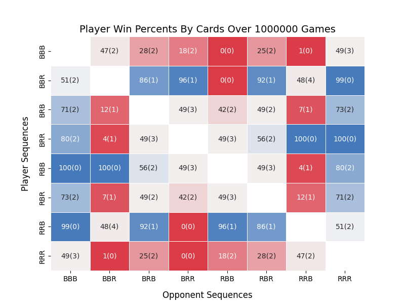
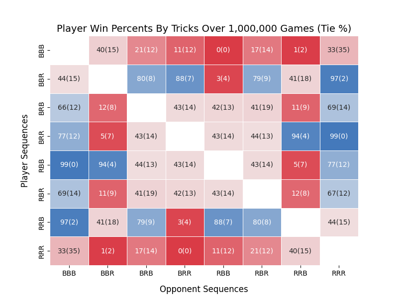

# Penney's Game Simulator

## Description
Penney's Game is a two-player game where each player selects a sequence of "Heads" and "Tails" on a coin. The coin is flipped until either sequence occurs, and whoever's first wins. [Wikipedia](https://arc.net/l/quote/opdootvb) covers its key aspects and insights. This specific program simulates a version of the game using playing cards with red or black cards. This introduces a new layer of conditional probability. It generates decks and visualizes the game outcomes in heatmaps that display winning and tie probabilities based on different criteria (i.e. winning by a majority of tricks or cards).

Wikipedia only shows win percentages for the best strategies but lacks information on other combinations of a player's choosing. [Wikipedia's percentages](https://arc.net/l/quote/fmpqixcb) also appear to be slightly off. _B and R stand for Black and Red respectively._

<div align="center">
   
</div>

<div align="center">
   
</div>

## Features
- **Deck Generation**: Generate decks of card sequences based on a provided seed.
- **Visualization**: Plot heatmaps showing the winning probabilities for each player based on tricks and cards.

## How to Run
1. Clone the repository
2. Install Python (3.12.4)
3. Install [uv](https://github.com/astral-sh/uv)
   ```bash
   pip install uv
   ```
5. Dependencies are installed upon first run, but may be done manually with
   ```bash
   uv sync
   ```
6. Run the main script:
   ```bash
   uv run main.py
   ```
7. Follow the on-screen prompts to generate decks or calculate games and plot results.

## Expected Inputs
- For generating decks:
  - Seed (integer): A number to seed the random number generator.
  - Number of decks (integer): The number of decks to generate.
  - _Note: Seeds are persistent and generated decks and random states will be stored across runtimes for deterministic behavior._
  
- For plotting results:
  - Seed (integer): A number for which seed to visualize (must be consistent with one used in deck generation).
  - _Only a single seed is visualized at a time_
 
**Seed 0 contains 1M precomputed decks for which a heatmap can be instantly generated. Choose option 2 and input seed 0 to view this.**

## TODOs
- Implement user input validation to handle unexpected or incorrect inputs gracefully.
- Develop unit tests for key functionalities (e.g. deck generation).
- Add edge case handling, including:
  - Pathing Issues
  - Manage cases where no decks are generated before plotting.
- Enhance user experience with clearer prompts and error messages.

